# VerifyAI
**A browser extension that audits LLM citations in real time — before you act on them.**
*24-Hour Hackathon Submission*

---

## 1. Product Overview

### The Problem
Large language models have become a default research tool for millions of people. Students, professionals, and everyday users ask LLMs questions and receive confident, well-structured answers — often accompanied by cited sources. The problem is that LLMs hallucinate. They fabricate statistics. They attribute claims to real papers that never made those claims. They cite URLs that do not exist, or worse, real URLs whose content says something entirely different from what the model claimed.

Existing tools address this at the platform level (e.g., Gemini Grounding, Perplexity citations, SearchGPT), but they all share the same blind spot: **they verify that a source exists, not that the source actually supports the specific claim being made.** A green checkmark next to a real journal URL is not the same as a verified fact.

### What VerifyAI Does
VerifyAI is a browser extension that intercepts LLM responses, extracts every cited source, and runs a multi-layer verification pipeline in the background. By the time the user has finished reading the response, each source has been scored and a trust verdict is displayed inline — without the user having to do anything.

The verification pipeline operates on two levels simultaneously:
1. **Layer 1: Metadata credibility** — using the CRAAP Test framework (Currency, Relevance, Authority, Accuracy, Purpose) to evaluate the source's publication date, author attribution, domain tier, and institutional standing.
2. **Layer 2: Claim-level content verification** — fetching the actual source body, extracting the text, and checking whether the specific sentence the LLM cited is semantically supported by what the source actually says.

The result is a trust score, a plain-English verdict, and — where sources fall short — curated alternative sources that are pre-verified and directly relevant to the topic.

### Who It Is For
- **Students** conducting research who cannot afford to cite a fabricated statistic in an essay.
- **Professionals** who use LLMs to brief themselves on technical or legal topics before meetings.
- **Journalists and fact-checkers** who need to verify AI-assisted research quickly.
- **Anyone** who has ever copy-pasted an LLM answer and later found out it was wrong.

### The Core Differentiator
VerifyAI does not just check whether a link works. **It reads the source.** It asks whether the source actually contains the information the LLM claimed it does. This separates a metadata badge from genuine verification — and it is what no native LLM platform currently offers at the claim level.

---

## 2. How It Works — The Verification Pipeline

VerifyAI utilizes a rigorous 7-stage pipeline to convert raw LLM output into an actionable trust verdict.



### Stage 1: Signal Extraction & Semantic Claim Matching (Per Source)
For each cited URL, the pipeline checks URL liveness and extracts content using a fallback chain. It then parses the CRAAP metadata and extracts five independent signals in parallel:


1. **Domain Credibility:** Tier classification (academic journal, official body, established news, etc.). A confirmed DOI overrides domain tier entirely.
2. **Publication Recency:** Calculated from the extracted publication date. Missing dates are flagged.
3. **Author Presence:** Named individuals score higher than corporate bylines; no author is a credibility concern.
4. **Relevance to Query:** Meaningful terms from the original prompt are matched against the source title and body.
5. **Claim Alignment (Highest Weight):** Checks if the cited sentence is supported by the source text. Matches are output as **Supported** (Claim found in source) or **Unsupported** (Absent or contradicted).

### Stage 2: Composite Scoring
The five signals are combined using a weighted formula:
- **Domain credibility** and **Claim alignment** carry the highest weight.
- **Author presence** carries the lightest weight.
- **URL liveness is a hard gate** — a dead link produces a score of 0 regardless of all other signals.
- A confirmed DOI adds a credibility bonus to the overall score.

### Stage 3: Verdict Mapping
Scores are mapped directly into a trust level:
- **≥ 75 — Reliable:** Source is real, credible, current, and supports the claim.
- **50 to 74 — Treat with caution:** Something meaningful is weak or missing.
- **< 50 — Be skeptical:** Multiple signals are poor; seek better sources.
- **0 — Unverified:** Dead link or the source cannot be checked entirely.

### Stage 4: Plain English Generation
Scores and signals are converted into human-readable explanations using a transparent template system (not an LLM, to prevent hallucination). Each verdict receives a reason (why it scored the way it did) and an implication (what the user should do).

### Stages 5 & 6: Topic Detection and Further Reading
Once verdicts are established, the system uses keyword clusters from the prompt and AI response to detect the overarching topic. It then curates **3 pre-verified alternative sources** for further reading, automatically filtering out any URLs the LLM has already cited.

### Stage 7: Assembly
All verdicts are sorted reliably-first and packaged into a structured object alongside summary counts. This object is sent to the extension front end, which renders the results inline. 

---

## 3. Content Extraction Stack

Content extraction uses a two-step fallback chain, designed for maximum coverage and low latency:
- **Step 1 — HTTP GET:** Fast raw HTML fetch. Sufficient for static pages, open-access journals, Wikipedia, government sites, and most news outlets. Parsed with Mozilla Readability to strip boilerplate.
- **Step 2 — Playwright fallback:** Full headless Chromium instance for JavaScript-rendered pages where GET returns an empty DOM. Runs server-side.
- **Graceful degradation:** Paywalled or bot-blocked pages are explicitly flagged as *'content inaccessible — metadata only'*, ensuring an honest signal rather than hiding the failure.

---

## 4. Challenges, Debates, and Future Directions

### Key Design Tensions
- **The Threshold Problem:** Adjusting thresholds (like a 75-point cutoff for 'Reliable') is a product values decision. The architecture allows for flexible turning on recency vs. authority or making semantic alignment a hard-gate requirement.
- **The Auditor Paradox:** Can you use an AI to check an AI without compounding hallucinations? VerifyAI avoids this by ensuring the auditor does not generate. Claim matching uses string/term overlapping and plain English is standardly templated.
- **Scope Honesty:** A tool that admits what it cannot check is more trustworthy than one that silently skips it. Paywalls, dead links, and missing authors are deliberately surfaced as caution flags.

### Future Roadmap
- **Embedding-based Semantic Similarity (v2):** Moving beyond keyword overlap to catch paraphrasing without a full LLM inference call.
- **User-adjustable Signal Weights:** Letting power users prioritize recency for fast-moving domains.
- **Cross-Source Contradiction Detection:** Flagging when two sources in the same response contradict each other.
- **History and Learning:** Tracking which LLM + topic combinations produce the most citation failures.
- **Enterprise API Access:** Allowing organizations to pipe LLM outputs through the verification backend programmatically.

---

## 5. Design Principles

- **The auditor must not hallucinate** — no generative models in the verification path.
- **Transparency over false confidence** — show limitations, flag unknowns, never silently pass.
- **Speed through architecture, not shortcuts** — HTTP GET first, Playwright only when needed.
- **Plain language over numbers** — verdicts communicate intent, not just scores.
- **Pre-verified alternatives** — further reading is curated by humans before the hackathon, not generated at runtime.

---

## 6. Getting Started

Follow these steps to get VerifyAI running locally.

### Prerequisites
- **Python 3.10+**
- **Node.js (v18+)** or **Bun**

### Backend Setup (Python)
The backend handles source extraction, scraping, and scoring.

1. **Install Python dependencies:**
   ```bash
   pip install -r requirements.txt
   ```

2. **Install Playwright browsers:**
   ```bash
   playwright install chromium
   ```

3. **Install Ollama (for scoring):**
   - Download from [ollama.com](https://ollama.com/).
   - Pull the required model: `ollama pull qwen3.5:2b` (or your preferred model).

4. **Run the extractor server:**
   ```bash
   python verity_extractor.py
   ```
   *The server will start on `http://localhost:8001`.*

### Frontend Setup (React/Vite)
The frontend is a dashboard for viewing analysis results during development.

1. **Install Node dependencies:**
   ```bash
   npm install
   # or
   bun install
   ```

2. **Run the development server:**
   ```bash
   npm run dev
   # or
   bun dev
   ```
   *The dashboard will be available at `http://localhost:8080` (or the port shown in your terminal).*

### Extension Installation
1. Open Chrome and navigate to `chrome://extensions/`.
2. Enable **Developer mode** in the top right.
3. Click **Load unpacked**.
4. Select the `verity-extension` folder from this repository.

---

> **VerifyAI** — Built to reduce AI misinformation risk, one citation at a time.
